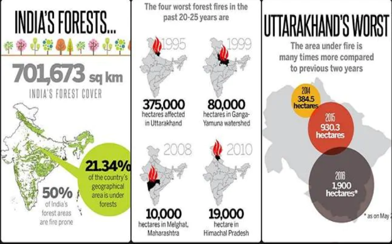
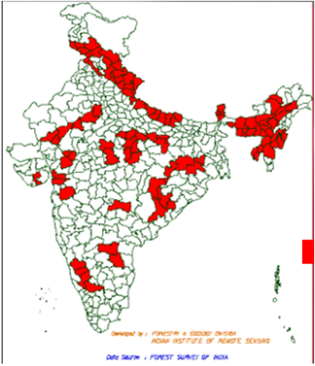

 # Problem

   
   

 When we look around, our nature we can see N number of natural calamities. 
 One of the major extinction of natural resources is due to wildfire. In the 
 past few years, we can see the continuous affection of wildfire around the 
 globe.
     Most of the wildfires in India account for human activities on 2019 over
 30000 forest fires were reported all over India, and sadly 95% of the forest
 fires in India are on account of human activity. 
       The Forest Survey of India released a report last year, analyzing areas 
 in India prone to fires. Out of the total 7,12,249 square km of forest cover,
 1,52,421 square km (21.40 percent) is either highly or extremely fire-prone.
 The forests of Mizoram, Chhattisgarh, Manipur, Odisha, and Madhya Pradesh are 
most vulnerable.
 

[source](https://theecologist.org/2020/sep/11/forest-fires-india)

Major extinction of animals and plants is due to wildfire.