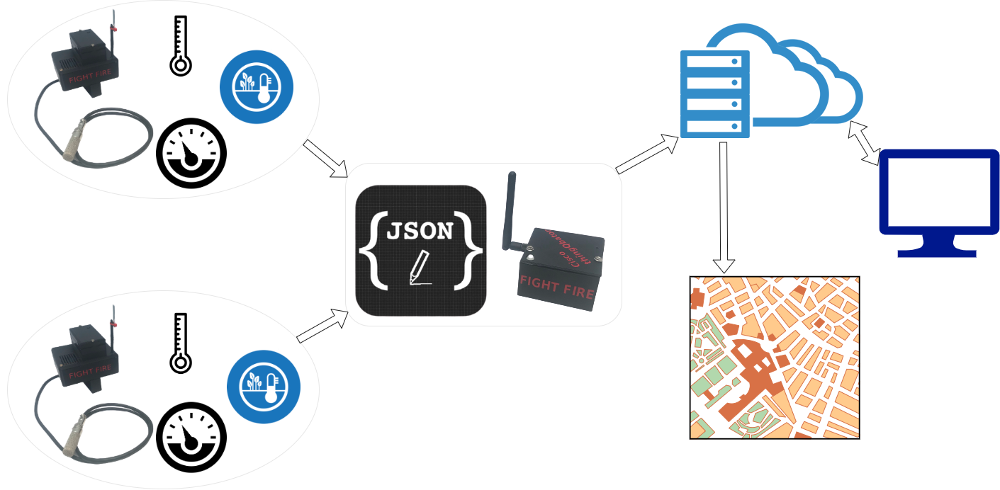

# Proposed solution 
 Fight Fire is a wildfire prediction device that will allow the local fire fighting authority to respond quickly to the wildfire. We know that the wildfire is due to the climatic change in the forest, based on this we monitor the weather condition of the forest using various sensors and record the dramatic increase in atmospheric temperature, decrease in soil moisture, and changes in atmospheric pressure.[(Source)](https://www.c2es.org/content/wildfires-and-climate-change/#:~:text=Climate%20change%20has%20been%20a,in%20the%20Western%20United%20States.&text=Research%20shows%20that%20changes%20in,these%20increases%20in%20wildfire%20risk.)

Fight Fire nodes are fixed in fire-prone area, and by utilizing the mesh network of the node, the firefighting authority can plan for fire prevention. At the same time node identify the presence of humans and animals in a hazardous area.  

