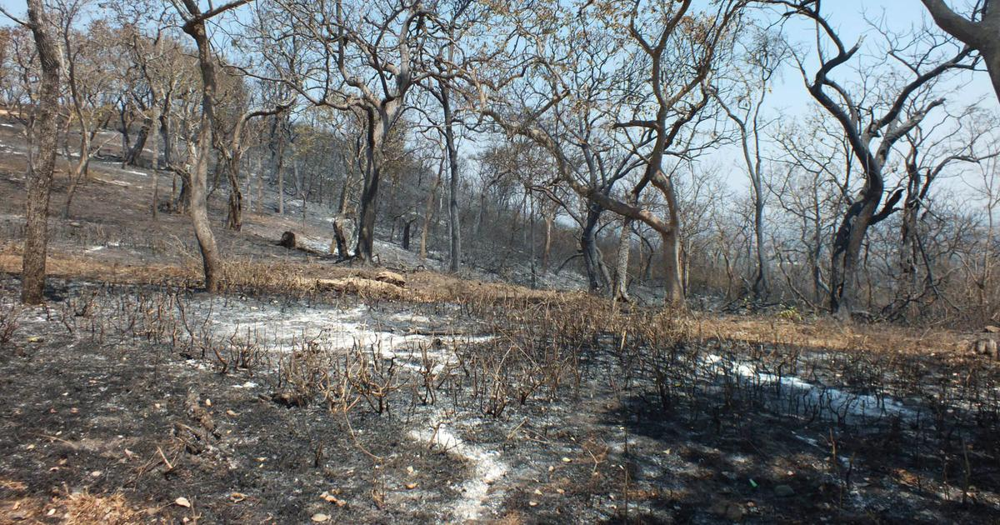

# Reason for wildfire

   

   Wildfire is mainly due to the drastic change in soil moisture, temperature, and atmospheric pressure. Increasing global warming around the world is one of the main reasons for wildfire. Dried leaves and trees are one of the other reasons for wildfire. Obviously, this will be due to the drought condition of the woods.
