# Journey:  
#### The project is divided into Five categories,  
* Hardware  
* Software  
* Application/Cloud Development  
* 3D Designing


### ELECTRONICS & PROGRAMMING
#### Software Used:-  
* [Arduino IDE](https://www.arduino.cc/en/Main/Software)  For programming   
* [Eagle](https://www.autodesk.com/products/eagle/free-download) for PCB designing  
* [Fusion360](https://www.autodesk.com/products/fusion-360/students-teachers-educators) for 3D designing

Whole architecture 
  
  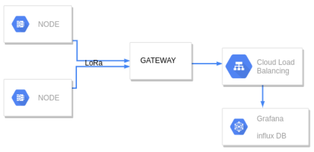

    
Node
  
  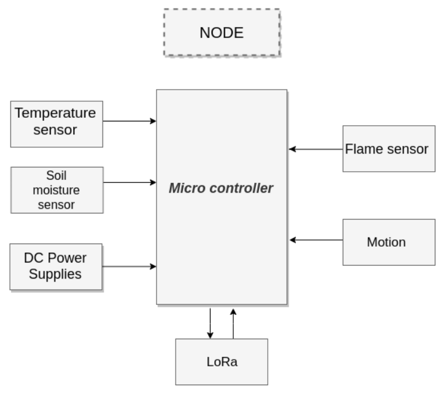
    
### Sensor Module
Initially i use **SHT1x** for measuring the moisture level of the soil, **BME280**  for to measure the temperature,**Doppler Radar** sensor , **Flame Sensor**

### 1.SHT1x
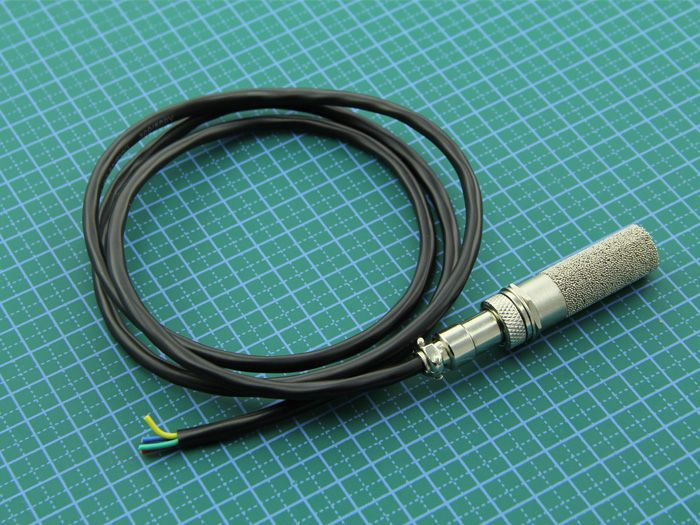  
Moisture and temperature of the soil can be measured by using this sensor.The typical temperature resolution is 0.4°C, while typical moisture resolution is 3%RH. With a copper sintered mesh over the sensor, we don’t want to worry about its anticorrosion performance.

  
#### Features
  * High resolution  
  * Durable, stable and reliable  
  * Industrial level gadget  
  * Serial two-wire interface

#### Specifications  
  * Temperature measuring range: -40 ~ +123.8°C   
  * Moisture measuring range: 0 ~ 100% RH   
  * Moisture measuring range: 0 ~ 100% RH   
  * Moisture accuracy: ±3%RH  
  * Wires: Red = VCC (3-5VDC), Black or Green = Ground, Yellow = Clock, Blue = Data.

 [Datasheet](http://www.seeedstudio.com/document/rar/datasheet.zip)  
 [Arduino library to support SHT1x-series](https://github.com/practicalarduino/SHT1x)

   
 #### Testing
 When we connect all the pins in the form of given above we got an error like this.  
  
  
  To solve this problem connect a pull up resistor of 10k as given below
  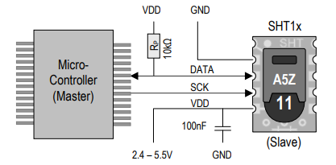
  (this is also mentioned in datasheet)
Then you will get a accurate data
 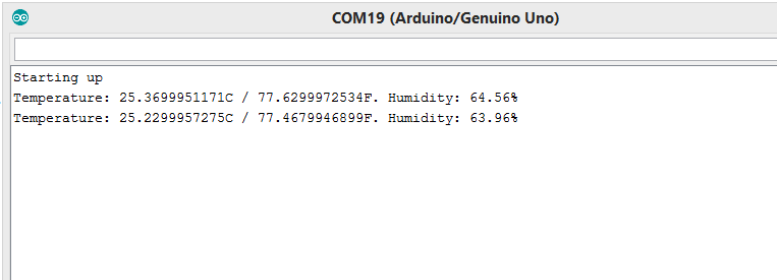
### 2.BME 280
 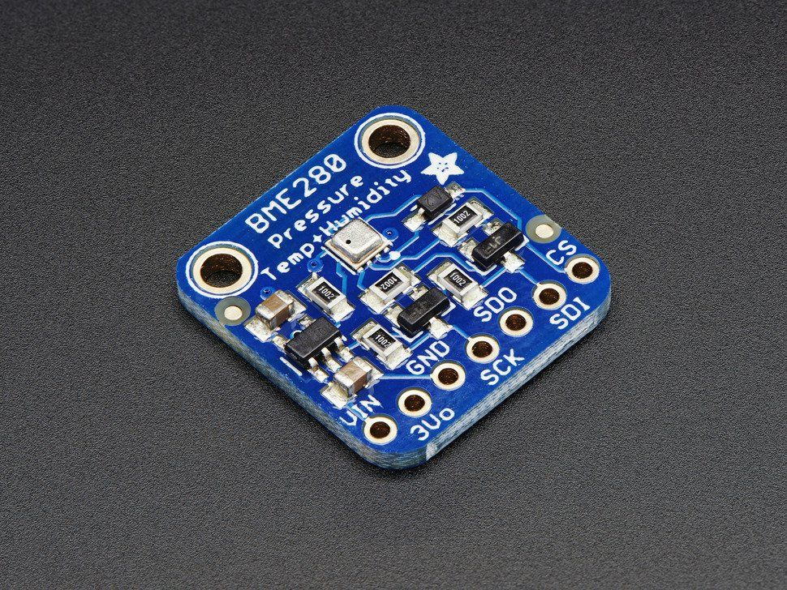
   BME280 is an environmental sensor with temperature, barometric pressure and humidity.This precision sensor from Bosch is the best low-cost sensing solution for measuring humidity with ±3% accuracy, barometric pressure with ±1 hPa absolute accuracy, and temperature with ±1.0°C accuracy.  
#### Features  
   * High sensitive  
   * Industrial level gadget

#### Specifications  
* Humidity is measured to within +/-3%;  
* Atmospheric pressure to within +/-1 hPa. When measuring altitude, you’ll achieve readings that are accurate to within 1 m, or even less;  
* Temperature readings are provided to the nearest degree.  
* VCC(3.3V-5V),GND(GND),SCL(SCL),SDA(SDA)
  
[Adafruit_BME280 library supportfor arduino (code in github repository)](https://github.com/adafruit/Adafruit_BME280_Library)
[Datasheets](https://learn.adafruit.com/adafruit-bme280-humidity-barometric-pressure-temperature-sensor-breakout/downloads)


#### Testing
Connect the BME280 based on the above connection and attach the .zip library file
 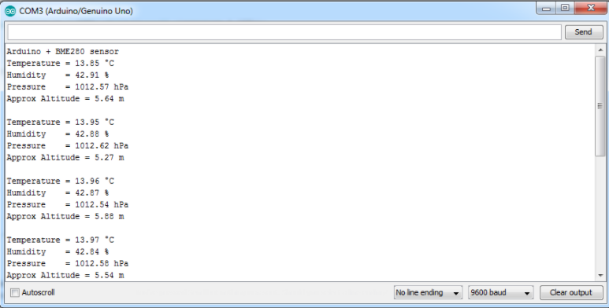

### 3.Doppler Radar sensor
 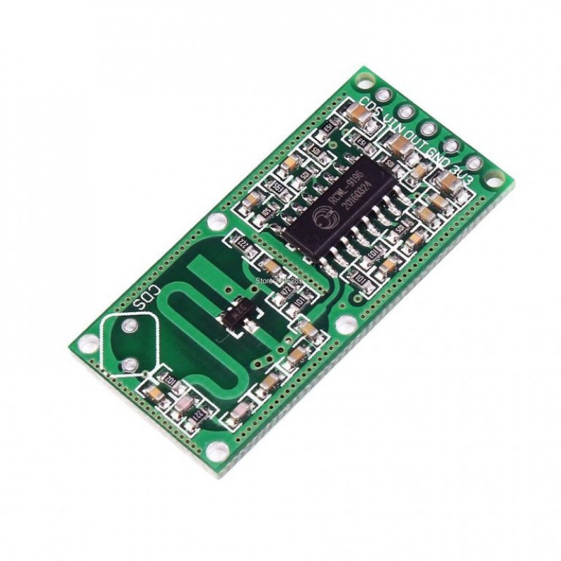

This is a motion sensor with 360 degree no blind angle detection and maximum 7m sensing distance.this is a digital sensor so this is easy to implement in our use case.  
#### Features:  
* Operating Voltage: 4-28V  
* Operating Current: 2.8mA (typical); 3mA (max)  
* Operating Temperature: -20~80 celsius  
* Storage Temperature: -40~100 celsius  
* Board Size: 35.9 X 17.3mm/1.41 X 0.68inch

#### Specifications:  
* Detection Distance: 5-9m  
* 360 degree motion detection  
* VIN(5V),GND(GND),OUT(to a digital pin)

Just connect all the pin that mention above ,then upload a digitalread example code.When ever there is a motion it will give a high value(1) ,or when there is no any motion it will return (0).

### 4.Flame Sensor 
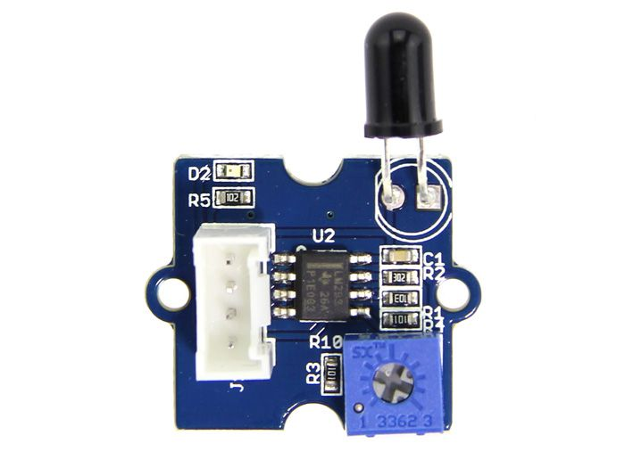
Flame Sensor can be used to detect fire source or other light sources of the wavelength in the range of 760nm - 1100 nm

#### Feature
* High Photo Sensitivity  
* Fast Response Time  
* Easy to use  
* Sensitivity is adjustable


This is simply connect VIN(5V),GND(GND),OUT(to a digital pin) and upload a digitalread code to your development board  and read the value.


#### Data transmission
In this project data transmission is using LoRa SX1276
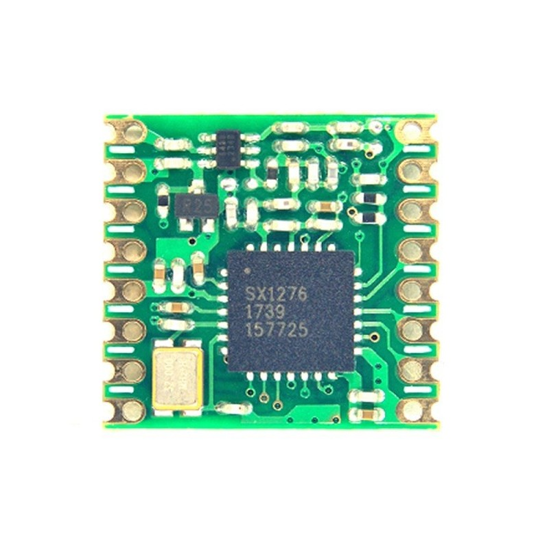
LoRa transceivers feature a long-range wireless modem that provides ultra-long range spread spectrum communication and high interference immunity while minimizing current consumption. Our patented modulation technique allows transceivers within this product family to achieve sensitivities of -137dBm and -148dBm respectively. The high sensitivity combined with the +22dBm power amplifier make these transceivers optimal for any application requiring range or robustness. LoRa technology provides significant advantages in both blocking and selectivity over conventional modulation techniques, solving the traditional design compromise between range, interference immunity and energy consumption. The LoRa RF platform complements M2M cellular infrastructure and provides a low-cost solution to connecting battery operated devices to the network infrastructure.

[SX1276-7-8-9 Datasheet](https://www.semtech.com/uploads/documents/DS_SX1276-7-8-9_W_APP_V6.pdf)  
[Arduino library to support LoRa](https://github.com/sandeepmistry/arduino-LoRa/archive/master.zip)

**Connections**
The connections are same in both transmitter and receiver.  

| Semtech SX1276/77/78/79 | Arduino |
| ----------- | ----------- |
|VCC  |3.3V|
|GND |GND|
|MISO | MISO|
|SCK | SCK|
| MOSI| MOSI|
|NSS | 10|
| RESET| 9|
|DIO0 | 2|  

Attach the above LoRa library file to arduino IDE and use the example code and run it.

#### Testing
WITHOUT USING ANTENNA DO NOT POWER UP YOU LoRa, IT MAY BE DAMAGED.
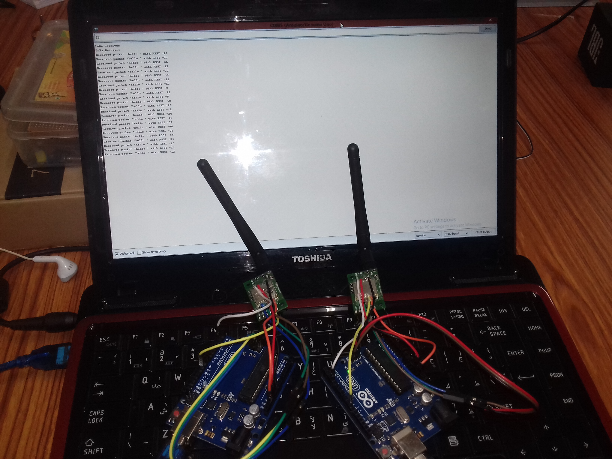


#### PCB DESIGNING
I started designing with eagle with Atmega328 .First we want to burn arduino  bootloader, using SPI communication protocol with ICSP interface.  Then next programm your board using UART programming mode.


We can mill our pcb form [Jlcpcb](https://jlcpcb.com/),[pcbway](https://www.pcbway.com/) etc.

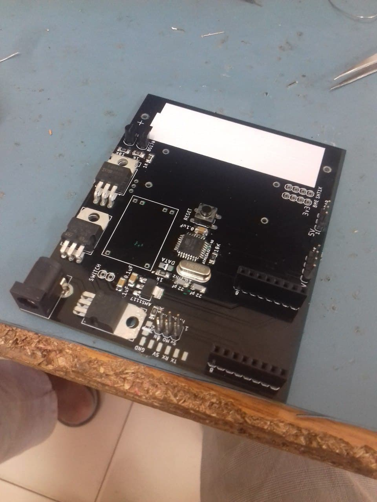
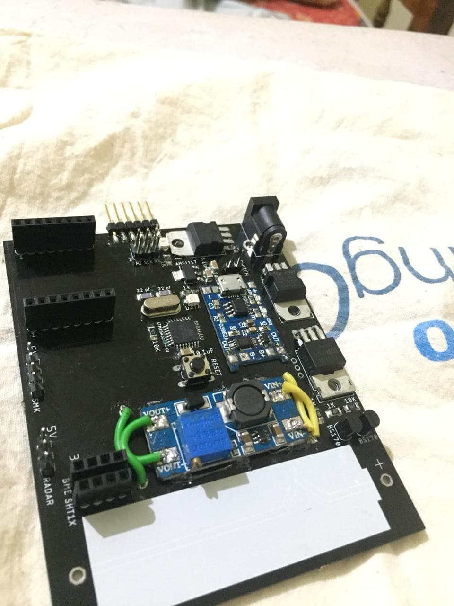


**Components used for node**  
1-Atmega328=1  
2-NCP1117 3.3v - SOT223=1  
3-Push Button - 3112P SMD=1  
4-Capacitor 10uf - 1206 SMD=2  
5-Resistor 10k - 1206 SMD=2  
6-Capacitor 22pf=2  
7-Crysta l16Mhz=1  
8-LED RED - 1206 SMD=2  
9-Resistor 220ohm - 1206 SMD=2  
10-FTDI Male Header - SMD=1  
11-SMD SPI Header=1  
12-Header pin  
13-ISP Programmer =1

**Node using basic components**
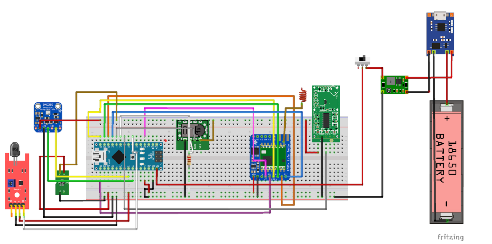

Install all the given library in Arduino IDE and let's begin for testing
 [Code](****)

 **Some time the programme didn't upload,at that time unmount or disconnect the SPI connection to LoRa.**
 In here we send the data in the form of json. it help us to call all the data into the database.Then we want to setup the GATEWAY(bridge b/w node and server. In gateway we use an ESP32 interface with a LoRa module.  
  
  | Semtech SX1276/77/78/79 | ESP32 |
| ----------- | ----------- |
|VCC  |3.3V|
|GND |GND|
|MISO | D19|
|SCK | D18|
| MOSI| D23|
|NSS | D5|
| RESET| D14|
|DIO0 | D2|
   
   Now upload the programme given below into ESP32.
  [Code](****)

#### Initially I set up a local server in Raspberry pi 3B+
**[MQTT](http://mqtt.org/)**
I chose MQTT (Message Queuing Telemetry Transport) protocol other than traditional HTTP, because it is a special machine-to-machine (M2M)/"Internet of Things" connectivity protocol. It was designed as an extremely lightweight publish/subscribe messaging transport. It is useful for connections with remote locations where a small code footprint is required and/or network bandwidth is at a premium.
I publish-subscribe messaging pattern requires a message broker.so here am using Mosquitto.
  Open terminal in Raspberry Pi or connect  the pi using SSH ,in In this project   I'm using LINUX machine so i don't need to install other programs.

When we are using our PC first enable SSH in PI  
```$ ssh pi@<IP>```

Then install  Mosquitto broker by typing  
```$ sudo apt-get install mosquitto```
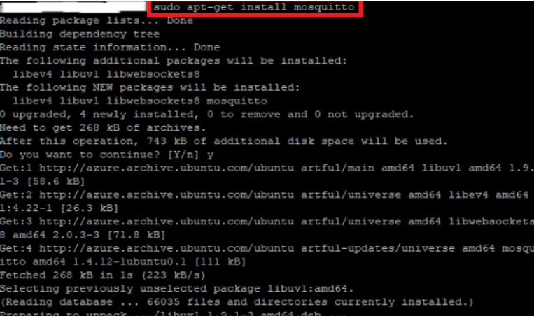  
and i installed Mosquitto Clinets by typing  
```$ sudo apt-get install mosquitto-clients```  
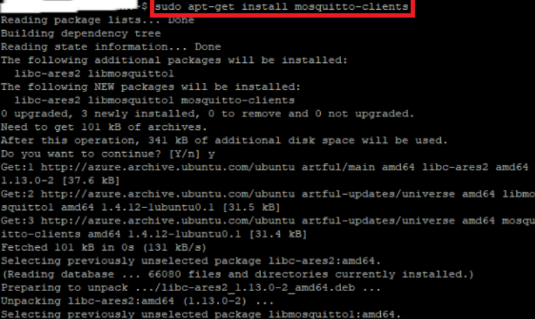  
Now i are successfully installed MQTT Broker
```$ mosquitto_sub -h <ip> -t <topic name>```  
I subscribed the  MQTT topic that we used for sending from the gateway.  
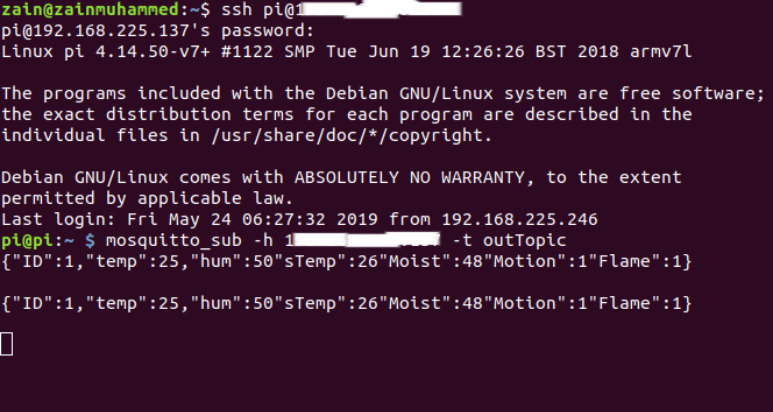
 Then we need to install node red, influx DB and grafana for data visualisation.
Here node red act as a conditioning , grafana visualise the data in dashboard and all data is stored in InfluxDB.
For installation of [node red](https://nodered.org/docs/hardware/raspberrypi)

Then set up the node red
[nodered](img/25.png)
Then type ``` $ node-red  ``` in terminal 
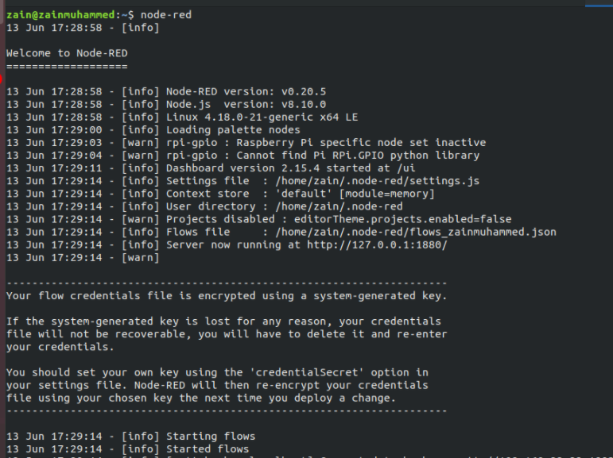
Due to some technical issue i install node red in my PC.

The data will receive in this form because we send our data in the form of json.
For full documentation of node-red ,[influxDB and grafana](https://www.youtube.com/watch?v=JdV4x925au0) ,for more detail of [grafana](https://grafana.com/docs/installation/debian/) ,and for [influx DB](https://www.influxdata.com/products/influxdb-overview/).
Next i purchase a [digitalocean](https://www.digitalocean.com/products/linux-distribution/ubuntu/) server.And finally I setup full full hardware and dashboard in grafana.

#### 3D Designing
I use Fusion 360 for 3D designing.
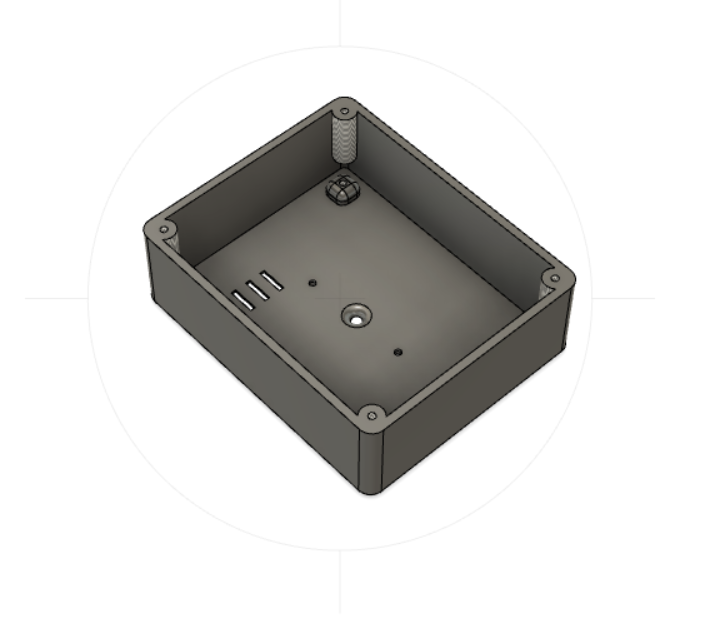
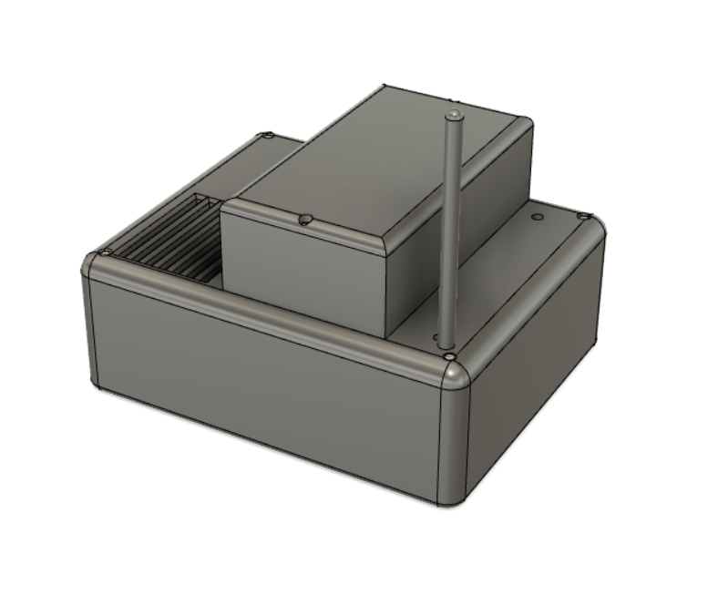
[STL File]()
 
#### Finally i create a monitoring system
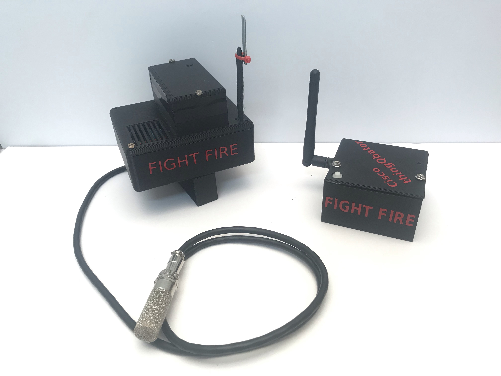
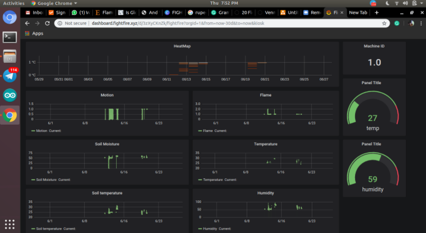
